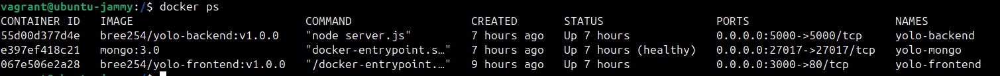
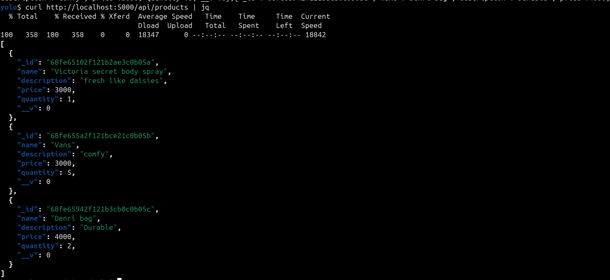
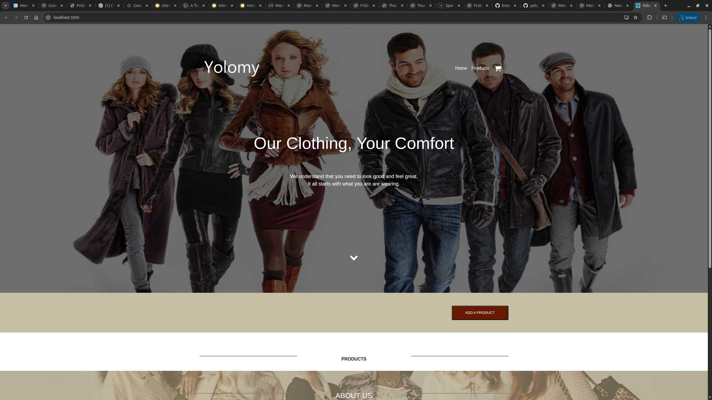
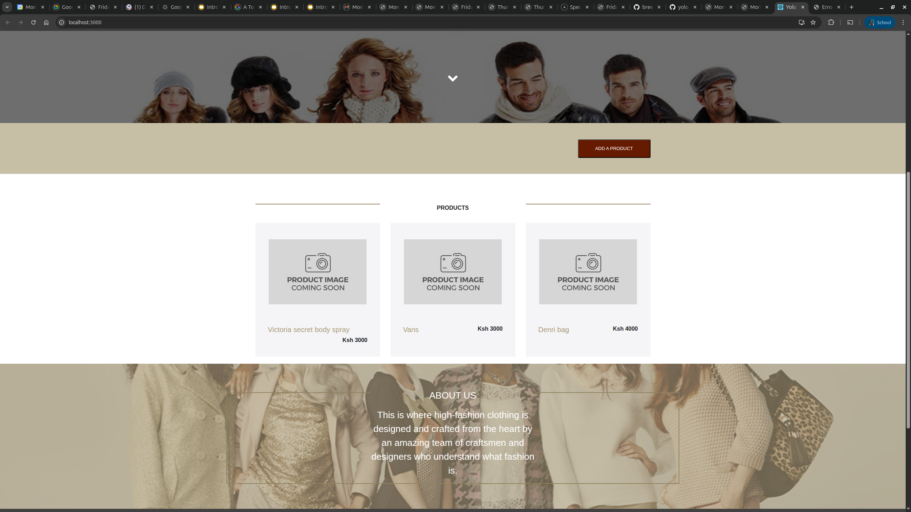
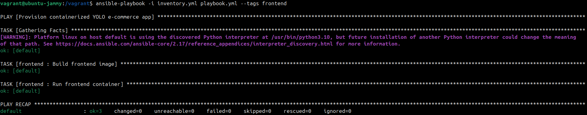
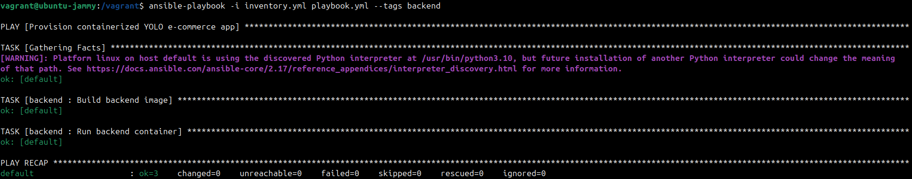
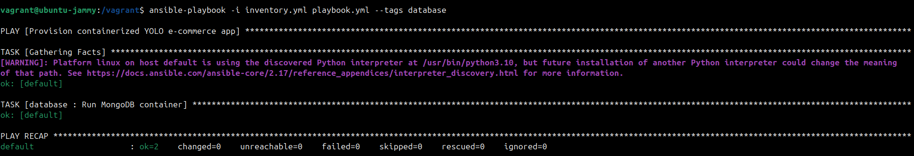
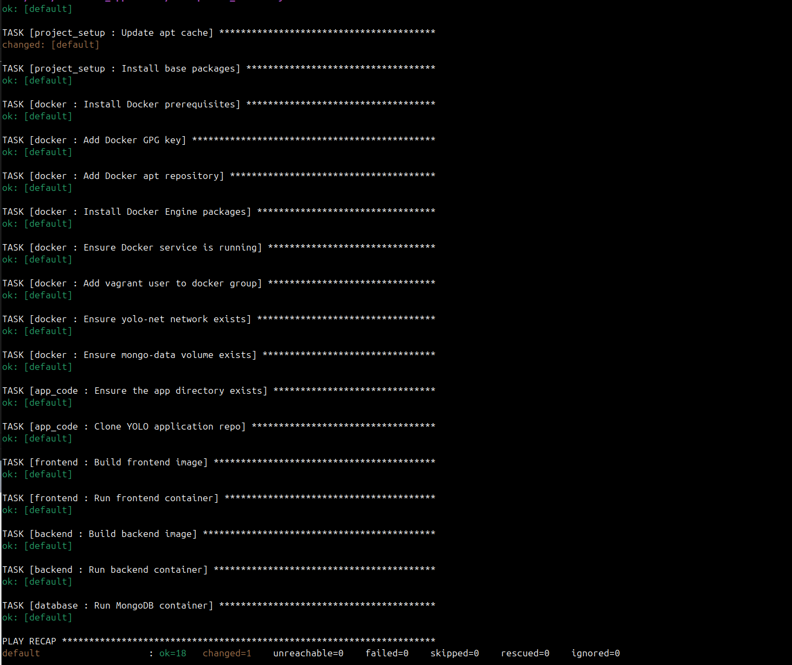

# YOLO E-commerce | Stage 1 Infrastructure

## Project Overview
This repository contains the Stage 1 deliverable for the YOLO e-commerce platform. The `vagrant up` command boots an `ubuntu/jammy64` virtual machine, installs Docker, clones the web application, builds the frontend and backend images, and deploys the three containerized services (frontend, backend API, MongoDB) with persistence.

## Prerequisites
1. [VirtualBox](https://www.virtualbox.org/) 7.x
2. [Vagrant](https://developer.hashicorp.com/vagrant/downloads) 2.4+

> The VM uses the `ansible_local` provisioner so no SSH keys or controller-side Ansible installation are required.

## Getting Started
```bash
# 1. Clone this repo
$ git clone https://github.com/bree254/yolo.git
$ cd yolo

# 2. Start and provision the VM (downloads box on first run)
$ vagrant up

# 3. When provisioning finishes, verify the containers
$ vagrant ssh -c "sudo docker ps"
$ curl http://localhost:5000/api/products
```
Docker ps


Products


## Ports and Access
- Frontend: http://localhost:3000
- Backend API: http://localhost:5000
- MongoDB: localhost:27017 (forwarded for local debugging)

Products added via the UI persist because Mongo mounts the managed `mongo-data` volume.

Frontend UI



Add Product



## Inventory and Tags
The playbook runs inside the guest with ansible_local, so tags are invoked from the VM:

```bash
$ vagrant ssh
vagrant@...$ cd /vagrant
vagrant@...$ ansible-playbook -i inventory.yml playbook.yml --tags frontend
```

Available tags: `project_setup`, `docker`, `app_code`, `frontend`, `backend`, `database`.

 Examples:

Frontend Tag


Backend Tag


Database Tag


## Repo Structure

- `Vagrantfile` – VM and Ansible provisioner configuration
- `playbook.yml` – Orchestrates the roles (see explanation.md for ordering decisions and Ansible module choices)
- `group_vars/all.yml` – Shared variables (paths, container names, ports)
- `roles/` – Individual roles for setup, Docker, code checkout, and services
- `screenshots/` – Reference images used in this README

## Troubleshooting
```bash
vagrant provision
```



## Cleaning Up
```bash
$ vagrant halt        # stop the VM
$ vagrant destroy -f  # remove the VM and all containers
```

## Stage 2 (optional)
Stage 2 (Terraform + Ansible) is not implemented yet.
