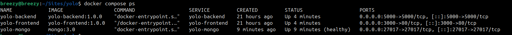
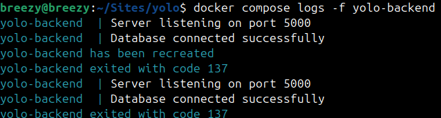
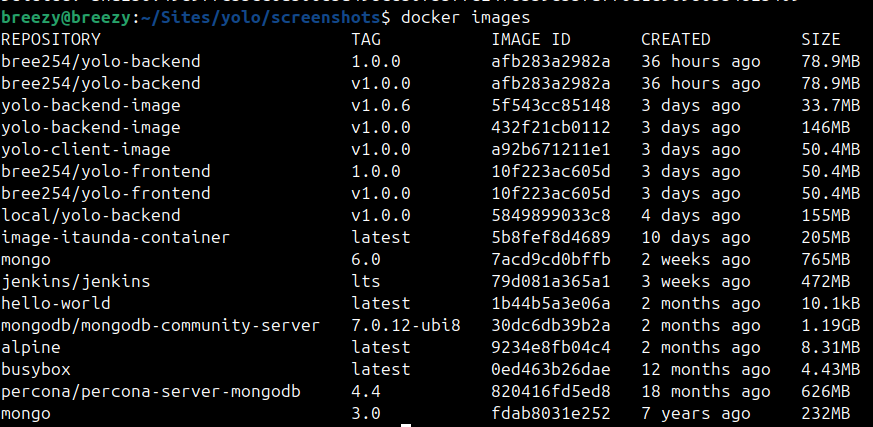
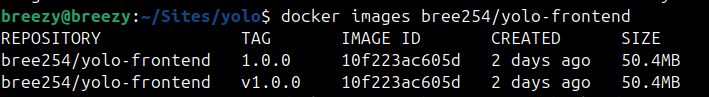
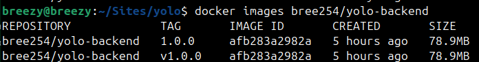
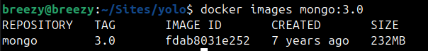

# Yolo microservice platform

## Overview
This project involves a containerized e-commerce dashboard YOLO.The docker compose orchestrates three services :
- `yolo-frontend` - spa compiled to static assets and served by nginx
- `yolo-backend` - an express API for CRUD operations on products
- `yolo-mongo` - MongoDB with persisted volume for product data

## Requirements
- Docker Engine 24+ with the compose plugin
- A docker hub account for publishing the images  in the `docker-compose.yaml`

## Getting started
1. Clone the repository and be on the root directory of the project
2. Build and start the stack 
```bash 
docker compose up --build
```
3. To verify the stack we run
```bash 
docker compose ps
```
 
 ```bash 
docker compose logs -f yolo-backend
```
 

4. To see the images and check their sizes we run 
```bash 
docker images 
```
 
For specific image sizes you can run 
```bash 
docker images bree254/yolo-frontend
```
 
```bash 
docker images bree254/yolo-backend
```
 
```bash 
docker images mongo:3.0.
```
 

5. From the rubric the image requirements were for the images to be below 400 mbs and ours with the frontend backend and database images they come to 362mbs which is right below the 400mbs

6. Once you do that , go to http://localhost:3000 and add products. The backend is on http://localhost:5000 and the data is persisted to the Mongo volume.


7. To check if everything worked well ,once on the website you click the add product button and see if you can add the product and if the products you added can be seen


8. Then to check the data persistence you can bring the slack down by first `CTRL + C` and then running these commands 
```bash 
docker compose down
docker compose up -d --pull always
```
when you check the website again and see your products still there you know the persistence works 

## Publishing images 
We push the images to Docker hub by running the following commands 
```bash
docker compose build
docker login
docker compose push
```
### Docker Hub repository

### Docker Hub Frontend tag

### Docker Hub Backend tag


