# YOLO Platform

1. **Docker Compose microservice stack** – local-first workflow for building/publishing the frontend, backend, and MongoDB images.
2. **Stage 1 infrastructure** – a reproducible Vagrant VM that provisions the same stack with Ansible roles and tags.
3. **Orchestration Using Kubernetes** –  This extends the project onto Google Kubernetes Engine (GKE).

---

## Docker Compose Microservice Stack

### Overview
The containerized YOLO dashboard runs as three services managed by `docker-compose.yaml`:
- `yolo-frontend`: React SPA compiled to static assets and served by NGINX
- `yolo-backend`: Express API that persists products to MongoDB
- `yolo-mongo`: MongoDB with a named volume for data durability

### Requirements
- Docker Engine 24+ with the Compose plugin
- Docker Hub account for `docker compose push` (images reference `bree254/*`)

### Getting Started
1. Clone the repo and stay in the project root.
2. Build and launch the stack:
   ```bash
   docker compose up --build
   ```
3. Verify the services:
   ```bash
   docker compose ps
   docker compose logs -f yolo-backend
   ```
   
   
4. Inspect image sizes:
   ```bash
   docker images
   docker images bree254/yolo-frontend
   docker images bree254/yolo-backend
   docker images mongo:3.0
   ```
   
   
   
   
5. Size target: combined images (frontend 50.4 MB, backend 78.9 MB, Mongo 232 MB) total 362 MB, comfortably below the 400 MB rubric threshold.
6. Browse http://localhost:3000 to add products. Backend runs on http://localhost:5000 and writes to the `mongo-data` volume.
   
   
7. Validate CRUD + persistence:
   - Add a product through the UI.
   - Bring the stack down and back up to confirm data remains:
     ```bash
     docker compose down
     docker compose up -d --pull always
     ```

### Publishing Images
```bash
docker compose build
docker login
docker compose push
```


---

## Stage 1 Infrastructure (Vagrant + Ansible)

## Project Overview
This repository contains the Stage 1 deliverable for the YOLO e-commerce platform. The `vagrant up` command boots an `ubuntu/jammy64` virtual machine, installs Docker, clones the web application, builds the frontend and backend images, and deploys the three containerized services (frontend, backend API, MongoDB) with persistence.

## Prerequisites
1. [VirtualBox](https://www.virtualbox.org/) 7.x
2. [Vagrant](https://developer.hashicorp.com/vagrant/downloads) 2.4+

> The VM uses the `ansible_local` provisioner so no SSH keys or controller-side Ansible installation are required.

## Getting Started
```bash
# 1. Clone this repo
$ git clone https://github.com/bree254/yolo.git
$ cd yolo

# 2. Start and provision the VM (downloads box on first run)
$ vagrant up

# 3. When provisioning finishes, verify the containers
$ vagrant ssh -c "sudo docker ps"
$ curl http://localhost:5000/api/products
```
Docker ps


Products


## Ports and Access
- Frontend: http://localhost:3000
- Backend API: http://localhost:5000
- MongoDB: localhost:27017 (forwarded for local debugging)

Products added via the UI persist because Mongo mounts the managed `mongo-data` volume.

Frontend UI


Add Product


## Inventory and Tags
The playbook runs inside the guest with ansible_local, so tags are invoked from the VM:

```bash
$ vagrant ssh
vagrant@...$ cd /vagrant
vagrant@...$ ansible-playbook -i inventory.yml playbook.yml --tags frontend
```

Available tags: `project_setup`, `docker`, `app_code`, `frontend`, `backend`, `database`.

 Examples:

Frontend Tag


Backend Tag


Database Tag


## Repo Structure

- `Vagrantfile` – VM and Ansible provisioner configuration
- `playbook.yml` – Orchestrates the roles (see [explanation.md](explanation.md) for ordering decisions and Ansible module choices)
- `group_vars/all.yml` – Shared variables (paths, container names, ports)
- `roles/` – Individual roles for setup, Docker, code checkout, and services
- `screenshots/` – Reference images used in this README
- [`Structure`](Structure) – Directory tree of the repository

## Troubleshooting
- If provisioning fails or you change code, rerun:

```bash
vagrant provision
```


- Re-run a single component via tags (inside the VM):
```bash
ansible-playbook -i inventory.yml playbook.yml --tags backend
```
    
- Check container logs:
```bash
 vagrant ssh -c "docker logs yolo-backend"
```

## Cleaning Up
```bash
$ vagrant halt        # stop the VM
$ vagrant destroy -f  # remove the VM and all containers
```

## Stage 2 (optional)
Stage 2 (Terraform + Ansible) is not implemented yet.

---

## GKE Orchestration
Here we extend the project onto Google Kubernetes Engine (GKE). The `manifests/` directory replaces `docker-compose` in production:

- `mongo-statefulset.yaml` – MongoDB StatefulSet, headless service, and PVC template for persistent cart data.
- `backend-deployment.yaml` – Replica-managed API Deployment plus a Service (NodePort when fronted by ingress).
- `frontend-deployment.yaml` – Replica-managed React/NGINX Deployment plus a Service (NodePort).
- `backend-config.yaml` – Custom health check so GCE probes `/api/products` before routing traffic.
- `ingress.yaml` – GCE HTTP(S) ingress that routes `/api/*` to the backend service and all other requests to the frontend.

The StatefulSet and PVC guarantees deleting the Mongo pod doesn’t drop the catalog documents. Services/labels keep pods discoverable, and the ingress provides a single public URL.

### Deploying to GKE
1. **Build and push the images**
   ```bash
   docker build -t bree254/yolo-frontend:v1.0.0 ./client
   docker push bree254/yolo-frontend:v1.0.0
   docker build -t bree254/yolo-backend:v1.0.0 ./backend
   docker push bree254/yolo-backend:v1.0.0
   ```
2. **Provision a cluster and authenticate kubectl**
   ```bash
   gcloud container clusters create yolo-application \
     --zone us-central1-a \
     --num-nodes 3 \
     --machine-type e2-standard-2 \
     --disk-type pd-standard \
     --disk-size 30 \
     --addons HttpLoadBalancing

   gcloud container clusters get-credentials yolo-application --zone us-central1-a
   ```
   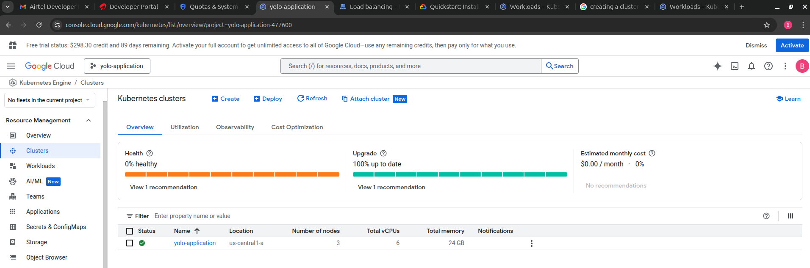
3. **Apply the manifests**
   1. MongoDB StatefulSet + Service

      ```bash
      kubectl apply -f manifests/mongo-statefulset.yaml
      kubectl get pods -l app=mongo
      ```
      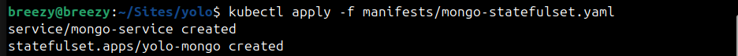

      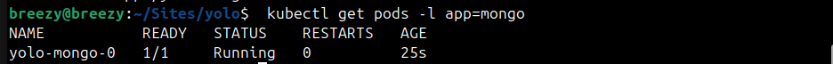

   2. Backend Deployment + Service (NodePort) + BackendConfig

      ```bash
      kubectl apply -f manifests/backend-config.yaml
      kubectl apply -f manifests/backend-deployment.yaml
      kubectl get pods -l app=yolo-backend
      kubectl get svc backend-service
      ```
      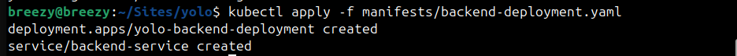

      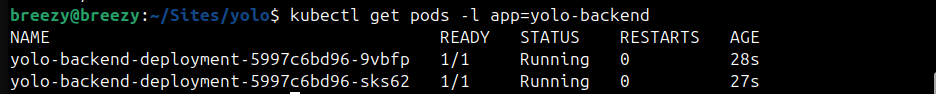

      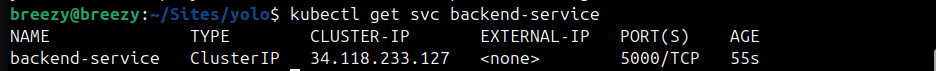

   3. Frontend Deployment + Service (NodePort)

      ```bash
      kubectl apply -f manifests/frontend-deployment.yaml
      kubectl get pods -l app=yolo-frontend
      kubectl get svc frontend-service
      ```
      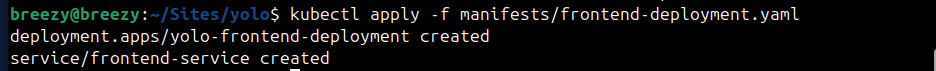

      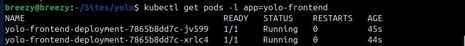

      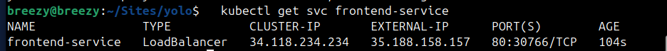

   4. Ingress (single public IP)

      ```bash
      kubectl apply -f manifests/ingress.yaml
      kubectl get ingress yolo-ingress
      ```
      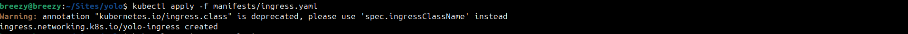

      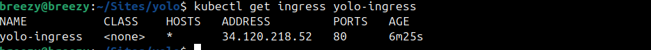

      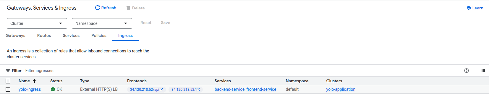

4. **Expose the app to the Internet**

   ```bash
   kubectl get ingress yolo-ingress
   ```
   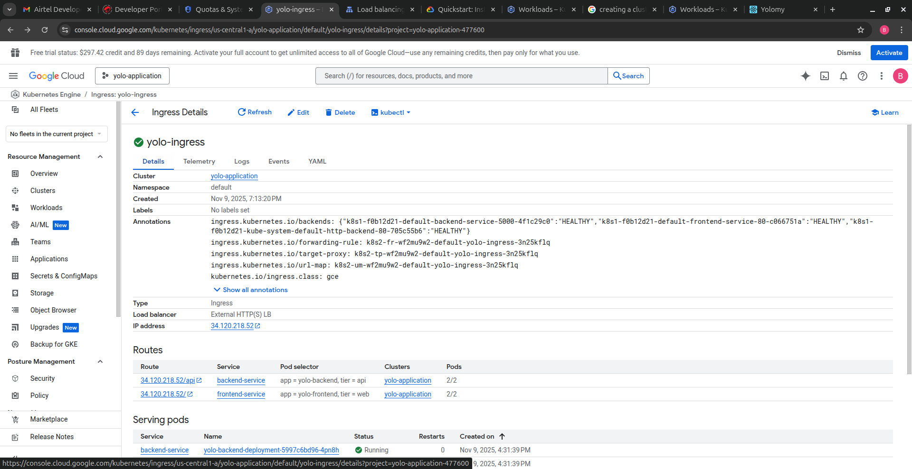

   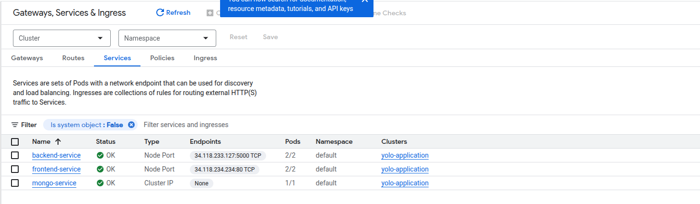

5. **Smoke test the stack**

   ```bash
   curl http://34.120.218.52/api/products
   open http://34.120.218.52
   ```
   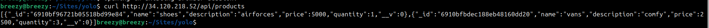

   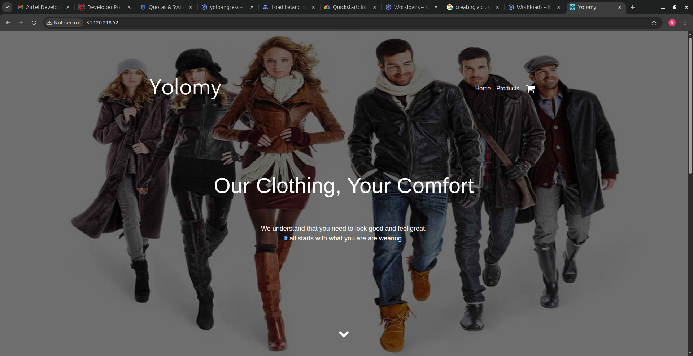

   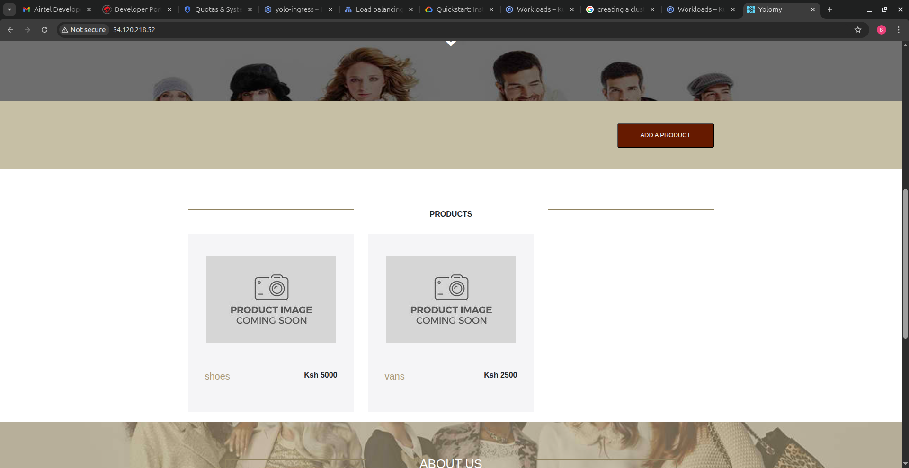

6. **Record the live URL**

   **Live demo:** `http://34.120.218.52`
