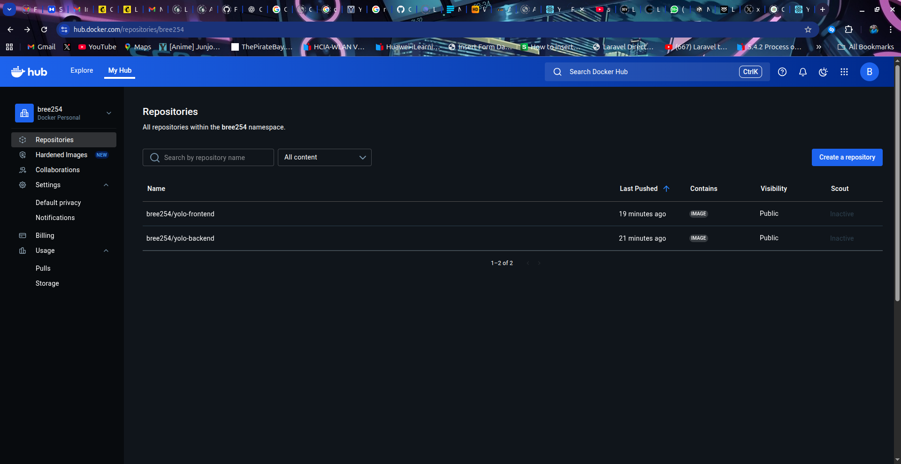
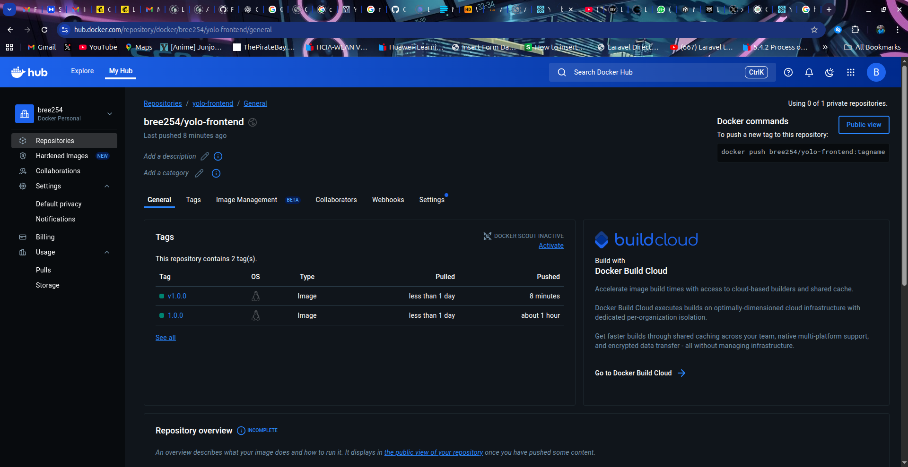
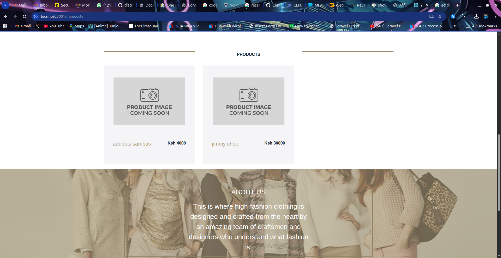

# YOLO Deliverables – Technical Explanation

1. **Part 1 – Docker Compose microservice stack** (local build/publish workflow).
2. **Part 2 – Stage 1 infrastructure with Vagrant + Ansible** (remote provisioning workflow).

## Part 1 – Docker Compose Microservice Stack

### 1. Base Image Selection
- **Frontend**
Uses `node:16-alpine` ,I chose alpine to keep it lightweight ,and on the version I decided to not use the version 14 cause it's a little outdated ,first tried using version 18 but it was quite big ,so I downgraded to a smaller version and 16 was the right balance.
For the runtime stage I used `nginx:1.25-alpine` cause after doing my research i realized it has a low footprint and the delivery performance is high.
- **Backend**
Runs on `node:16-alpine` ,which gives a supported LTS version of Node.js ,it provides the node 16 toolchain to run npm ci on top of Alpine Linux for minimal image size .
The runtime stage switches to `alpine:3.16.7` so the final container is smaller
- **Database**
Relies on mongo:3.0 
I tried pulling a few mongo images (4.2.24 was 388 MB)(6.0 was 765 MB), the images were verylarge so i decided to downgrade and this version had the least image size 232MB which fit into the rubric requirements .It's an older release but it's stil compatible with the Mongoose 5.x client in the setup.


### 2. Dockerfile Directives

#### Frontend
- **Building the react bundle**
  - `FROM node:16-alpine AS build` ,`WORKDIR /app` and `COPY package*.json ./` set up the builder with node
  - `RUN npm ci` used this instead of npm install because it removes node_modules,installs what is the package-lock.json ,which makes the installs faster and more suitable for docker builds.
  - `RUN npm run build` compiles the production bundle into `/app/build`
- **Building the react bundle**
  - `FROM nginx:1.25-alpine` provides a smaller image
  - `COPY --from=build /app/build /usr/share/nginx/html` publishes the compiled version
  - `EXPOSE 80` the public http port that Nginx also runs on
  and `CMD ["nginx" , "-g" , "daemon off;"]` starts Nginx in the foreground and keeps the docker container alive

#### Backend
I went with a two-stage build
- **Stage 1 Installing dependencies**
  - `FROM node:16-alpine AS build`
  - `WORKDIR /app` , `COPY package*.json ./` and `RUN npm ci --omit=dev` installs what is the package-lock.json,removes node_modules which is more suitable for docker builds

- **Stage 2 Runtime image**
  - `FROM alpine:3.16.7 AS prod` provides a smaller image
  - `ENV NODE_ENV=production` and `WORKDIR /app` sets up the runtime environment
  - `RUN apk add --no-cache nodejs` installs node.js in the final alpine stage to avoid  the container failing to build with a "node not found error"
  -  `COPY --from=build /app /app` copies the compiled files out of the builder stage
  -  `EXPOSE 5000` the port the server runs
  - `CMD ["node","server.js"]` whenever the container starts it boots the express server in production mode


### 3. Docker-compose networking
- **Networking Implemantation**
From the rubric ,we are required to implement custom bridge networks that connect the containers .So I decided to create yolo-net instead of the default bridge so the three services can live on their own subnet and avoid clashing with other projects.I chose a 172.30 range so it wouldnt overlap with anything else I run locally
- **Port allocation**
From my frontend container the port is pointed to port 80 but for compose I published it on port 3000 so I can acceess it on the browser.
The backend exposes 5000 for API calls and I kept Mongo's 27017 open in case I need to connect with a local shell


### 4. Docker-compose volume definition and usage
For this , I defined mongo-data a named Docker colume and mounted it at /data/db inside the Mongo container.Docker keeps the volume outside the container filesystem ,so even if I run `docker compose down` or rebuild the yolo-mongo container ,the BSON files remain untouched.
From the rubric requirements : the database survives the container restarts without any manual export/import .I tested this by removing the container ,bringing it back up and confirming that all previously added products were still there.


### 5. Git Workflow
For this project I decided to forego using feature branches, and  stayed on master since I’m the only contributor, but kept changes small and commit messages descriptive. Each major update followed the same loop ,edit locally, run `docker compose up -d --pull always` to make sure the stack and persistence still worked, then `git add`, commit, and push. I rebuilt the client Dockerfile first, then the backend Dockerfile, documenting both choices in `explanation.md`. After the compose rewrite I pushed new tags (`bree254/...:v1.0.0`) to Docker Hub, updated the compose file, and validated the pull before committing. The commit history follows that order ,I tackled the Dockerfiles first ,documented the reasoning , updated compose and its explanation, then wrapped things up with the remaining explanation.md sections and the README notes.

### 6. Running/Debugging 
- I ran `docker compose up -d --pull always` to make sure the published images work on a clean machine ,then to check if everything works fine I ran `docker compose logs -f yolo-backend` and saw a "Server listening on port 5000" and "Database connected successfully"
- I checked for data persistence by adding products on http://localhost:3000 ,starting the stack back up and seeing the products added still on the website ,which confirmed that the container survived restarts thanks to the mongo-data volume
- I was able to achieve the the 400MB limit ,50.4MB frontend ,78.9MB backend and 232MB for mongo db totaling to 362MB.
- When I tested `mongo:4.2.24`, the image was 388 MB, so I swapped to `mongo:3.0` to satisfy the rubric. I also solved a “node: not found” error by installing Node in the final Alpine stage (`RUN apk add --no-cache nodejs`).

### 7. Best Practices 
- Used semantic tags (v1.0.0)
- Aligning container names and image names in the docker-compose.yaml
- Docker Hub screenshots to show published images 
- The depend_on health check in the `docker-compose.yaml` ensures Mongo is ready before the backend service can start

### 8. Screenshots
### Docker Hub repository

### Docker Hub tags


### UI




## Part 2 – Stage 1 Playbook Explanation

### Role Order
This play runs in a dependency order :
 base OS setup -> Docker runtime -> application code checkout ->
  containerized services (mirroring `docker-compose.yaml`).
Each role builds on the previous one so later steps always find their prerequisites in place.

1. **project_setup**
This handles the project setup ,so that every other role has the base tooling it needs. 
It updates the apt cache then installs the shared packages required across the app e.g `git`,`curl`,`python3-pip`.

2. **app_code**
This ensures that the root directory exists.It uses the `file` and `git` module to clone the repository into `/opt/yolo` .Having the repository in place provides build contexts for the container roles.

3. **docker**
This installs the Docker engine (apt tasks + GPG key + repo ) ,starts  and enables the docker service ,adds vagrant to the docker group (giving root permission to run commands)
It also guarantees shared resources (`yolo-net` ,`mongo-data volume`) through `community.docker.docker_network` and `docker_volume`, ensuring the subsequent roles can attach containers immediately.

4. **frontend**
This builds the react/NGINX image through the `community.docker.docker_image` with the `API_BASE_URL` build argument.
It then runs the container on `yolo-net` exposing port 3000.It depends on the repo clone and Docker network.

5. **backend**
This builds the Node/Express image ,injects the `MONGODB_URI` through the environment variables ,and then runs the container exposing port 5000.
It relies on the Mongo being reachable on the Docker network.

6. **database**
The `community.docker.docker_container` launches `mongo:3.0` ,mounting the managed volume and adding the health check .
It provides persistence for backend operations.

### Variables and Defaults
- Created the `group_vars/all.yml` which holds the global settings: repo info, file paths, container names, host ports, and Docker network/volume names.
- Each role has its own defaults for role specific behaviour (image tags, env vars, container names,etc.) so overrides stay localized.

### Tags and Blocks
- Blocks ,group related tasks within each role and Tags let you rerun just a part of a play .
- Every role’s tasks sit inside a `block`, keeping related steps together and making tag assignment simple.
- Tags mirror the role names. After tagging each block, `playbook.yml` references roles as `{ role:frontend, tags: ['frontend'] }`, so Ansible can target just that component.
- After adding the tags to your tasks in the roles folder ,I updated the `playbook.yml` ,roles with the specific role and their tag
 - Inside the VM you can run:
    ```bash
    ansible-playbook -i inventory.yml playbook.yml --tags <tag-name>

  to execute a single slice (e.g., frontend, backend, docker) without touching the rest.

### Modules Used
- project_setup: `apt` (update cache, install base packages).
- app_code: `file`, `git`.
- docker: `apt`, `ansible.builtin.shell `(GPG key pipeline), `apt_repository`, `service`, `user`,`community.docker.docker_network`, `community.docker.docker_volume`.
- frontend/backend: `community.docker.docker_image` (build), `community.docker.docker_container` (run).
- database: `community.docker.docker_container` (with volume + healthcheck).

